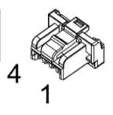

# Crater CAN

Internal repository for interfacing ESP32 micro-controllers and Maxon EPOS4 Motor Controllers with the Waveshare USB-CAN adapter.

## Table of Contents

- [Python Setup](#python-setup)
- [Firmware Overview](#firmware-overview)
- [Maxon EPOS4 Physical Setup](#maxon-epos4-physical-setup)
- [Using the EPOS4 Simulator](#using-the-epos4-simulator)
- [Hardware Connections](#hardware-connections)
- [Example Usage](#example-usage)

---

# Python Setup Instructions

## 1. Create a Virtual Environment

```bash
[CraterCAN/] $ python -m venv .venv
```

## 2. Activate the Environment

- **Mac/Linux**
  ```bash
  source .venv/bin/activate
  ```

- **Windows**
  ```powershell
  .venv\Scripts\activate
  ```

## 3. Install the Package

Installs `crater_can` in editable mode for development.

```bash
[(.venv) CraterCAN/] $ pip install -e .
```

---

# Maxon EPOS4 Physical Setup

To interface with Maxon EPOS4 controllers, follow these hardware guidelines:

## 1. Wiring the Bus

The CAN bus must be a daisy-chain. Ensure the two ends of the physical bus are terminated with `120Ω` resistors.

## 2. Configuration (EPOS Studio)

Before using this library, connect to your controllers via USB using Maxon EPOS Studio and ensure:

- **Node ID:** Set each motor to a unique ID (e.g., `1`, `2`, `3`)
- **Automatic Bitrate Detection:** Usually enabled by default; the motor will "listen" to the bus to sync its speed

## 3. CANopen Objects

This library uses:

- **SDOs (Service Data Objects)** for synchronous configuration
- **Heartbeats** for connectivity monitoring

### Units

- **Position:** Measured in `"quadcounts"` (typically `10,000` steps per rotation)
- **Velocity:** Measured in `RPM`

---

# Using the EPOS4 Simulator

If you do not have physical hardware, you can develop using the built-in simulator and a virtual serial bridge.

## 1. Setup Virtual Ports (macOS)

Install `socat` and create a bridge:

```bash
brew install socat
socat -d -d pty,raw,echo=0 pty,raw,echo=0
```

This will output two ports, e.g.:

```text
/dev/ttys001
/dev/ttys002
```

## 2. Launch the Simulator

Run the simulator on one of the two ports in a separate terminal. This provides a GUI with virtual motor dials and real-time logs.

```bash
python example/simulate_canbus.py --port /dev/ttys002
```

## 3. Run the Control Logic

Run your script on the first port.

```bash
python example/maxon_example.py --port /dev/ttys001
```

The simulator mimics the **CiA 402 State Machine**:

```text
Shutdown -> Switch On -> Enable
```

The virtual motor will not move unless the proper enable sequence is followed.

---

# Firmware Overview

The `firmware` directory contains the C implementation for the ESP32 TWAI driver.

## Core Files

- `ESP32_firmware/src/crater_can.c`
  - Hardware-specific TWAI implementation

- `ESP32_firmware/include/crater_can.h`
  - Agnostic structures and error types

- `ESP32_firmware/src/main.c`
  - Example main script for echoing and sending hearbeat

## Implementation Logic

`crater_can_init` installs the driver at `500 kbps`.

To send a frame, fill a `can_frame_t` and pass it to `crater_can_transmit`.

To receive a frame, use `crater_can_receive`, which blocks until a message arrives or a timeout occurs.

---

# Hardware Connections

## EPOS4 MAXON CONTROLELR



| Adapter Pin | CAN usage |
|---|---|
| 1 | CAN High |
| 2 | CAN Low |
| 3 | GND |
| 4 | Shield (optional) |

The dip switches on the controller control various CAN options.

Switches 0-5 are for setting the ID in binary format.

Switch 6 can enable or disable `auto-baudrate-detection`. Setting the switch low, turns on the setting.

Switch 7 can enable or disable the 120 $\Omega$ termination resistance. Setting the switch low, places it.

When connecting to the controllers via branches, it is important that all of them have the termination resistance turned on. If they are connected by daisy-chaining, only the last one should have the terminatino resitance.

## ESP32 to Transceiver

| MCU Pin | Transceiver Label |
|---|---|
| 5V or 3V | 5V or 3V |
| GND | GND |
| GPIO 4 | CAN TX |
| GPIO 5 | CAN RX |


## CAN BUS


Connect all the CAN_H, CAN_L and GND of each transceiver. Make sure to use one of the good, purple CAN cables for the actual long bus, and only use the molex adapters for short connection to the controllers. The color scheme that was used for now, was this:

| Color | CAN Wire |
|---|---|
| Blue | CAN_H |
| White | CAN_L |
| Black | GND |

---

## MAXON Configurations

The following tutorial assumes, that the controllers have already been configured for their respective motors, and only CAN needs to be set-up.

**Baudrate**: Go to the the Object-Dictionary and set the baudrate to 500 kbps. Then right-click and select save all parameters.

**Heartbeat**: Go to the Object-Dictionary and set the `Producer Heartbeat Time` to 1000ms. Then right-click and select save all parameters.

After configuring these two parameters, I always run the listen.py script found in `examples/listen.py`, and I see if I can see the heartbeat, which the various motors are sending. If you can see the heartbeat, you are done.

### Various debugging steps

- Is the light on the maxon controller blinking red or green? If it is red, connect to the controller with a Vala's window laptop, open EPOS studio and look at the error message.

- Are you using a new WaveshareAdapter? First use Vala's windows laptop and configure it with a dedicated software to actually listen to messages by setting mode to normal, baudrate to 500 kbps and deactivating all filters. 

- If you are completely new to CAN and setting up the controllers or micro-controller, start by simply getting the little echo-testbench to run on your laptop between the waveshare adapter and the ESP32, which is set-up at dübendorf. After you can use the waveshare adapter, go to Alex and let him explain to you how the battery management system works, so that you can turn on the motors safely. Finally, if you want to add a new controller to the network, go to Lionel and ask him how to connect the cables. For questions regarding the setup between the controllers and the motors ask Yunfei.

---

# Example Usage

After setting up the python environment and connecting the WaveshareAdapter to a CAN-network, you can start running some of the example scripts, found in the `examples` directory.

Make sure to first see which USB port the WaveshareAdapter is connecting to, and to run the various scripts with `--port PORT_NAME`.

Simple scripts to start with are `examples/listen.py` and `examples/send_heartbeat.py`. Also look inside of those scripts and try to understand what they do, so that you can also start writing your own scripts.